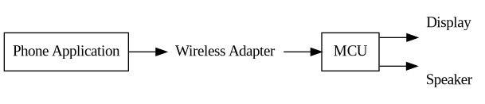

# Project Brief

## Project Description
I am making a miniature arcade machine that can be played utilizing an accompanying phone app. The objective of this project is to provide a fun desk decoration that can be turned on, connected to, and played quickly during downtime. The projected subsystems of this project include the audio, video, wireless connection, app, game logic, and 3D design.

## Part List

TODO

