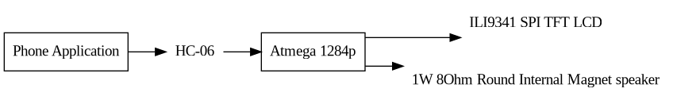

# Project Brief

## Project Description
This is a miniature arcade machine that can be played utilizing an accompanying phone app. The objective of this project is to provide a fun desk decoration that can be turned on, connected to, and played quickly during downtime. The projected subsystems of this project include the audio, video, wireless connection, app, game logic, and 3D design.

A small speaker is employed for audio, a color LCD for video, and a HC-06 for the interface between the phone app and the MCU through bluetooth. The chassis is designed utilizing openSCad and is  printed from a FDM printer, specifically the Ender 3 pro, using black eSun PLA+. The game logic is based off of the 1978 arcade game Space invaders.

[^1]: [Image Refrence](https://www.amazon.com/My-Arcade-Micro-Player-Machine/dp/B0897SHB6P/ref=sr_1_10?dchild=1&keywords=mini+arcade&qid=1600134827&sr=8-10)

## Part List

| Part | Quantity | Link | Price (USD) |
| ---- | -------- | ---- | ----------- |
| Screen | 1 | [Amazon](https://www.amazon.com/HiLetgo-240X320-Resolution-Display-ILI9341/dp/B073R7BH1B/ref=sr_1_2?dchild=1&keywords=TFT+ILI9341&qid=1600046103&sr=8-2) | 13.99 |
| Speaker | 1 | [Amazon](https://www.amazon.com/Yootop-Internal-Magnet-Loudspeaker-Speaker/dp/B07FMR5JGX/ref=sr_1_1?crid=TT1W7X8FLQTN&dchild=1&keywords=speaker+arduino&qid=1600126458&sprefix=speaker+ard%2Caps%2C226&sr=8-1) | 8.99 |
| MCU | 1 | [Mouser](https://www.mouser.com/ProductDetail/Microchip-Technology-Atmel/ATMEGA1284P-PU?qs=K8BHR703ZXgaD0L1rKdwiQ%3D%3D) | 5.36 |
| PLA+ | 1 | [Amazon](https://www.amazon.com/eSUN-1-75mm-Printer-Filament-2-2lbs/dp/B01EKEMDA6/ref=sxts_sxwds-bia-wc-p13n1_0?cv_ct_cx=esun+black&dchild=1&keywords=esun+black&pd_rd_i=B01EKEMDA6&pd_rd_r=e16e0515-7751-4130-9160-87e87d9693c6&pd_rd_w=i5Fmf&pd_rd_wg=yDAMG&pf_rd_p=e7ea7987-56a0-4822-adda-f67db5e22b16&pf_rd_r=Z6M4E0JNS14RG6T6WSZ5&psc=1&qid=1600135643&sr=1-1-791c2399-d602-4248-afbb-8a79de2d236f) | 23.99 |

